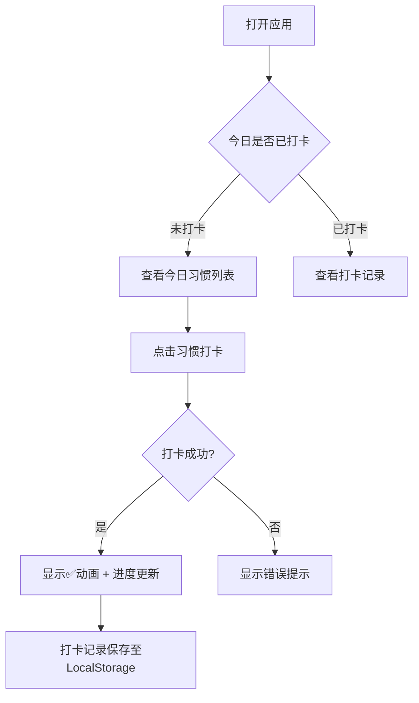
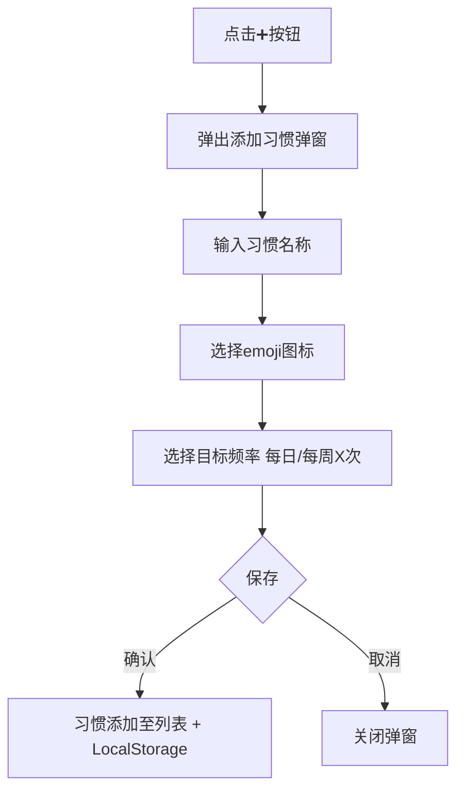

# 习惯星球 - 个人习惯追踪打卡应用 PRD

## 1. 产品概述

**习惯星球**是一款面向个人的习惯养成与打卡追踪工具，帮助用户建立每日习惯追踪、记录打卡进度、激励持续坚持。产品面向希望养成好习惯的个人用户，无需注册登录，数据存储在本地（LocalStorage），打开即用。

目标用户：想要追踪每日习惯（健身、阅读、早睡、喝水、学习等）的个人用户。

## 2. 核心功能

### 2.1 功能模块

1. **今日打卡面板**（首页）
   - 展示当前日期和今日所有习惯
   - 每个习惯一键打卡（点击即完成）
   - 打卡后有动画反馈
   - 统计今日打卡完成率

2. **习惯管理**
   - 添加新习惯（名称、图标/emoji、目标频率）
   - 编辑已有习惯
   - 删除习惯（带确认）
   - 支持习惯分组（早间习惯 / 晚间习惯 / 学习 / 运动 等）

3. **日历视图**
   - 月历展示本月打卡情况
   - 打卡日显示绿色/彩色，未打卡日显示灰色
   - 点击日期可查看当日打卡详情

4. **数据统计**
   - 连续打卡天数
   - 本周/本月打卡率
   - 打卡热力图（过去30天）

5. **成就系统**
   - 达成连续打卡里程碑时显示徽章（7天、30天、100天）
   - 达成时有庆祝动画

## 3. 核心流程

### 3.1 每日打卡流程

### 3.2 添加习惯流程

## 4. 用户界面设计

### 4.1 设计风格

**主题方向：活泼可爱·星球太空风**

| 元素 | 设计选择 |
|------|---------|
| **主色调** | 深蓝星空背景 `#0f0c29 → #302b63 → #24243e` 渐变 + 金色/粉色高光 |
| **强调色** | 活力橙 `#FF6B6B`、薄荷绿 `#4ECDC4`、阳光黄 `#FFE66D` |
| **卡片背景** | 白色/浅紫半透明毛玻璃 `rgba(255,255,255,0.1)` + backdrop-blur |
| **字体** | 显示字体：得意黑/方正综艺体（Fallback: Noto Sans SC Bold）；正文：Noto Sans SC Regular |
| **按钮风格** | 圆角胶囊形，hover 有弹性缩放效果，active 有按压反馈 |
| **图标风格** | Emoji 作为习惯图标 + SVG 装饰星球/星星 |
| **动画风格** | 打卡成功：彩色粒子爆发 + 打勾缩放；页面切换：滑动淡入；成就获得：星星雨特效 |
| **布局** | 桌面优先，单列居中，最大宽度 900px，类似桌面小工具感 |
| **背景装饰** | CSS 星星动画 + 悬浮星球 SVG |

### 4.2 页面设计概览

| 页面 | 模块 | UI 元素 |
|------|------|---------|
| 首页（今日打卡） | 顶部标题栏 | 当前日期 + 今日打卡进度圆环（动态） |
| | 习惯卡片列表 | 每张卡片：emoji + 习惯名 + 打卡按钮 + 连续天数标签 |
| | 底部导航 | 首页 / 日历 / 统计 / 设置（Tab 切换） |
| 日历视图 | 月份导航 | ◀ 2026年6月 ▶ |
| | 月历网格 | 7列（日到六），打卡日有绿点标记 |
| 统计页面 | 数据卡片 | 连续天数 / 本周完成率 / 总打卡次数 |
| | 热力图 | 30天打卡热力网格，颜色深浅表示完成度 |
| 成就页面 | 徽章墙 | 达成条件 + 彩色徽章 + 获得日期 |
| 设置页面 | 习惯管理 | 列表 + 编辑/删除 |
| | 主题切换 | 浅色/深色模式 |

## 5. 数据结构

| 数据项 | 字段 | 说明 |
|--------|------|------|
| 习惯 | id, name, emoji, color, createdAt, targetFrequency | 习惯基本信息 |
| 打卡记录 | habitId, date (YYYY-MM-DD), timestamp | 每次打卡对应一条记录 |

## 6. 技术选型

- **技术栈**：单文件 HTML + 内联 CSS + Vanilla JS（零依赖，浏览器直接打开）
- **数据存储**：LocalStorage（key: `habitPlanet_habits` / `habitPlanet_checkins`）
- **图标资源**：Emoji + 内联 SVG（无需外部 CDN）
- **字体**：Google Fonts - Noto Sans SC（仅正文）；得意黑（优先）

## 7. 验收标准

- [ ] 用户可在首页一键完成当日所有习惯打卡
- [ ] 打卡成功有视觉反馈动画
- [ ] 数据保存至 LocalStorage，刷新页面不丢失
- [ ] 可添加/编辑/删除习惯
- [ ] 日历视图清晰显示历史打卡情况
- [ ] 连续打卡天数统计准确
- [ ] 成就徽章在达成条件时自动解锁并有庆祝动画
- [ ] 深蓝星空 + 活泼彩色设计风格贯穿全应用
- [ ] 页面加载即用，无需注册登录
